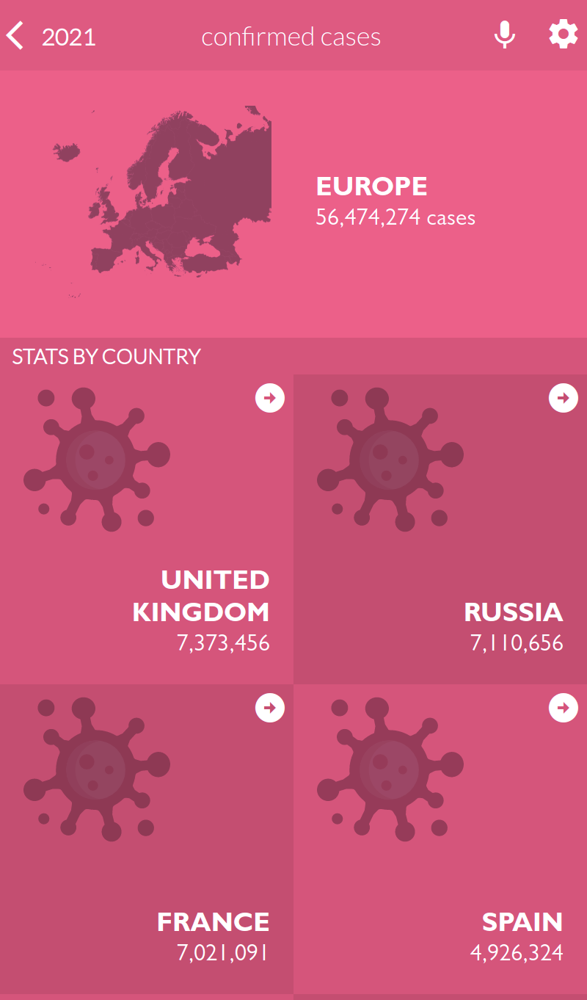

# React Capstone Project - Covid-19 Tracker


> Covid-19 Tracker



This application displays Covid-19 information from different data sources.

## Built With

- React & Redux

## Live Demo

[Live Demo Link](https://happy-stonebraker-4b4556.netlify.app/)
## Getting Started

To get a local copy up and running follow these simple example steps.

### Prerequisites

- NodeJS - [v16.x](https://nodejs.org/en/)

### Setup

```bash
git clone https://github.com/TSHEPO-CLOUD/react-capstone
cd ./repo_name
```

### Install

```bash
npm install
```

### Usage

```bash
npm start
```

### Build

```bash
npm run build
```

### Run tests

```bash
npm test
```

## Authors

👤 **Tshepo David Molefe**

- GitHub: [@githubhandle](https://github.com/TSHEPO-CLOUD)
- Twitter: [LinkedIn](https://twitter.com/tshepomolefem)
- LinkedIn:[tshepo-david-molefe](https://www.linkedin.com/in/tshepo-david-molefe/)

## 🤝 Contributing

Contributions, issues, and feature requests are welcome!

Feel free to check the [issues page](https://github.com/TSHEPO-CLOUD/react-capstone/issues/2)

## Show your support

Give a ⭐️ if you like this project!

## Acknowledgments

- Microverse
- Original design idea by [Nelson Sakwa on Behance](https://www.behance.net/gallery/31579789/Ballhead-App-(Free-PSDs))
- Powered by [Covid-19-API](https://github.com/M-Media-Group/Covid-19-API)

## 📝 License

This project is [MIT](./MIT.md) licensed.
